<picture>
  <source media="(prefers-color-scheme: dark)" srcset="assets/header-dark.svg">
  
</picture>

Hi, I'm Jeffrey, a fullstack developer at [Wisemen](https://wisemen.digital) in Hasselt, Belgium. I write TypeScript end to end: Nuxt on the front, NestJS or Bun + Elysia on the back, Postgres underneath. Most of that work lives in private client repos. The open-source part is Mimlet.

<details>
<summary>The terminal above is real output. Here's <code>whoami.ts</code>.</summary>
<br>

```ts
import { z } from 'zod';
import { fromZod } from '@mimlet/zod';

const Developer = z.object({
  name: z.string(),
  role: z.string(),
  basedIn: z.string(),
  stack: z.array(z.string()).min(1),
  building: z.string(),
  coffeesToday: z.number().int().min(1).max(9),
});

export const jeffrey = fromZod(Developer)
  .with({
    name: 'Jeffrey Nijs',
    role: 'Fullstack developer @ Wisemen',
    basedIn: 'Hasselt, BE',
    stack: ['TypeScript', 'Nuxt', 'NestJS', 'Bun + Elysia', 'Postgres'],
    building: 'Mimlet',
  }) // coffeesToday is left to Mimlet
  .buildValidated();
```

Nothing sets `coffeesToday`, so Mimlet generates a valid one. It's 6 on every run, because Mimlet fixtures are replayable.

</details>

<br>

<a href="https://github.com/JeffreyNijs/mimlet">
  <picture>
    <source media="(prefers-color-scheme: dark)" srcset="assets/mimlet/wordmark-dark.svg">
    
  </picture>
</a>

**Test data, with character.** Mimlet builds typed fixtures from the schemas you already have (Zod, Valibot, ArkType, TypeBox, Effect, JSON Schema, OpenAPI, GraphQL and more) and checks them against your own validation. Link related records into scenarios that stay consistent, and when a property-based test fails, shrink it and replay it later.

[Docs](https://jeffreynijs.github.io/mimlet/) · [Try it in your browser](https://jeffreynijs.github.io/mimlet/guide/try-it.html) · [Source](https://github.com/JeffreyNijs/mimlet)

<br>

<picture>
  <source media="(prefers-color-scheme: dark)" srcset="https://raw.githubusercontent.com/JeffreyNijs/JeffreyNijs/output/rhythm-dark.svg">
  
</picture>

<picture>
  <source media="(prefers-color-scheme: dark)" srcset="https://raw.githubusercontent.com/JeffreyNijs/JeffreyNijs/output/snake-dark.svg">
  
</picture>
